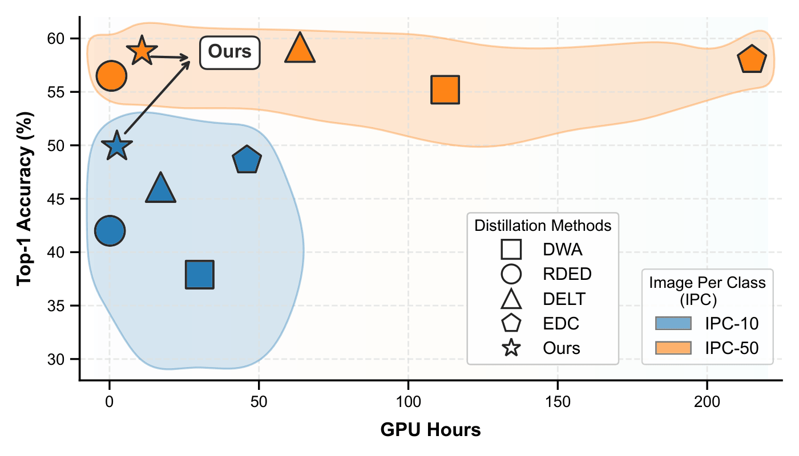
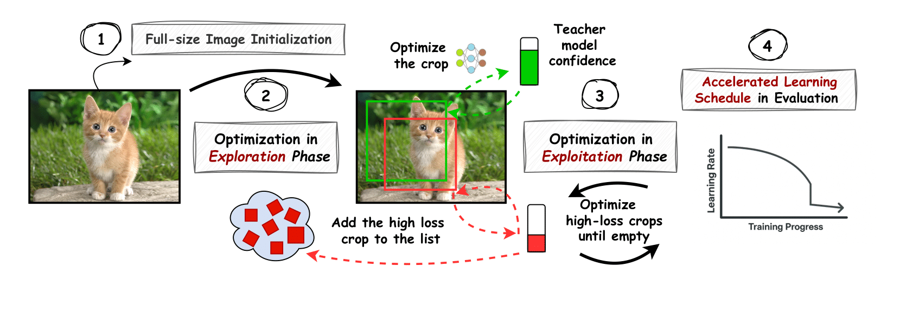

# 🚀 Accelerating Large-Scale Dataset Distillation via Exploration–Exploitation Optimization (E²D)


**Muhammad J. Alahmadi**<sup>1,2</sup> <a href="mailto:mjalahma@ncsu.edu" title="mjalahmadi@kau.edu.sa also available">📧</a>, **Peng Gao**<sup>1</sup>, **Feiyi Wang**<sup>3</sup>, **Dongkuan (DK) Xu**<sup>1</sup>  
<sup>1</sup>North Carolina State University · <sup>2</sup>King Abdulaziz University · <sup>3</sup>Oak Ridge National Laboratory

<p align="left">
  
  
  
  <a href="https://arxiv.org/abs/2602.15277"></a>
  
</p>

---

🧠 **TL;DR**  
**E²D** delivers 4–18× faster dataset distillation by removing redundancy in initialization and optimization through full‑image initialization and a novel targeted‑optimization strategy that eliminates redundant computation.


<p align="center">
  
</p>

---

## 📰 News & Updates
- **2026-02**: Initial public release of the E²D codebase.

---
## 📚 Table of Contents
- [🚀 Accelerating Large-Scale Dataset Distillation via Exploration–Exploitation Optimization (E²D)](#-accelerating-large-scale-dataset-distillation-via-explorationexploitation-optimization-ed)
  - [📰 News \& Updates](#-news--updates)
  - [📚 Table of Contents](#-table-of-contents)
  - [📝 Abstract](#-abstract)
  - [🔍 Overview](#-overview)
    - [🔀 Branches](#-branches)
    - [➡️ Pipeline](#️-pipeline)
  - [⚙️ Requirements](#️-requirements)
    - [📦 Datasets](#-datasets)
    - [🧠 Teacher Models](#-teacher-models)
    - [🔽 Distilled datasets](#-distilled-datasets)
  - [🗂️ Folder Structure](#️-folder-structure)
  - [📖 References](#-references)
  - [📑 Bibliography](#-bibliography)

---


## 📝 Abstract


Dataset distillation compresses the original data into compact synthetic datasets, reducing training time and storage while retaining model performance, enabling deployment under limited resources. Although recent decoupling-based distillation methods enable dataset distillation at large-scale, they continue to face an efficiency gap: optimization‑based decoupling methods achieve higher accuracy but demand intensive computation, whereas optimization‑free decoupling methods are efficient but sacrifice accuracy. To overcome this trade‑off, we propose Exploration--Exploitation Distillation (E$^2$D), a simple, practical method that minimizes redundant computation through an efficient pipeline that begins with full-image initialization to preserve semantic integrity and feature diversity. It then uses a two‑phase optimization strategy: an exploration phase that performs uniform updates and identifies high‑loss regions, and an exploitation phase that focuses updates on these regions to accelerate convergence. We evaluate E$^2$D on large-scale benchmarks, surpassing the state-of-the-art on ImageNet-1K while being 18$\times$ faster, and on ImageNet-21K, our method substantially improves accuracy while remaining 4.3$\times$ faster. These results demonstrate that targeted, redundancy-reducing updates, rather than brute-force optimization, bridge the gap between accuracy and efficiency in large-scale dataset distillation.

---

## 🔍 Overview

This repository contains the official implementation of  
**“Accelerating Large-Scale Dataset Distillation via Exploration–Exploitation Optimization.”**


### 🔀 Branches
- `Branch_ImageNet_1K` — ImageNet-1K experiments  
- `Branch_ImageNet_21K` — ImageNet-21K experiments  

Each branch provides a `run.sh` script that executes the full pipeline, from data synthesis to student training. Script hyperparameters match the paper; IPC and dataset paths are configurable at the top of each script.
### ➡️ Pipeline
E²D follows a decoupled dataset distillation framework with three stages:

1. **Recover** — synthesize distilled images  
2. **Relabel** — generate soft labels  
3. **Train** — train student models using distilled data and its soft labels. 

For ImageNet-21K, IPC is specified as a range to support progressive synthesis.  
For ImageNet-1K, IPC denotes the total number of distilled images per class and supports multi-GPU execution.

Baseline procedures follow **EDC** (ImageNet-1K) and **CDA** (ImageNet-21K).

---

## ⚙️ Requirements

- Python **3.9+**
- Dependencies listed in `requirements.txt`

### 📦 Datasets
- **ImageNet-1K**
- **ImageNet-21K** (Winter 2021 release, preprocessed)

Datasets can be obtained from the official ImageNet website, and they must follow the directory structure required by the  `ImageFolder`. For additional guidance, refer to RDED repository.


### 🧠 Teacher Models
- **ImageNet-1K**: Official pretrained model (no download required)
 - **ImageNet-21K**: Pretrained teacher model (from CDA). Download it from this [link](https://drive.google.com/file/d/1Pyq9afHP3NNpi5RAMWfmutJSGJLgPJcQ/view?usp=sharing) and place it at `Branch_ImageNet_21K/model/imagenet-21k_resnet18.pth`.

For faster setup, ImageNet-1K statistics can be downloaded from the **EDC** repository and also on this [link](https://drive.google.com/file/d/1dPlI0k0tGSgy6k4o4GCAckWvDhzF2Lad/view).


### 🔽 Distilled datasets
- Our distilled datasets can be downloaded from this [link](https://drive.google.com/drive/folders/1cWBsUIghwAys8Um2F7n3prHgV6x1fYUd)
---

## 🗂️ Folder Structure


    E2D Repo/
    ├─ Branch_ImageNet_1K/
    │  ├─ recover/        # Data synthesis
    │  │  └─ statistic    # Statistics collected from squeeze stage
    │  │      ├─ BNFeatureHook
    │  │      └─ ConvFeatureHook
    │  ├─ relabel/        # Soft label generation
    │  ├─ train/          # Student model training and evaluation
    │  └─ run.sh          # Full experiment script
    ├─ Branch_ImageNet_21K/
    │  ├─ recover.py      # Data synthesis
    │  ├─ relabel/        # Soft label generation (not used directly)
    │  ├─ validate/       # Soft labeling + model training and evaluation
    │  ├─ model/          # Pretrained teacher model
    │  │   └─ imagenet-21k_resnet18.pth
    │  └─ run.sh          # Full experiment script
    ├─ requirements.txt
    └─ README.md


---

## 📖 References

- [**EDC** — Elucidating the Design Space of Dataset Condensation](https://github.com/shaoshitong/EDC)
- [**SRe2L** — Squeeze, Recover and Relabel](https://github.com/VILA-Lab/SRe2L)
- [**CDA** — Dataset Condensation via Curriculum Data Synthesis](https://github.com/VILA-Lab/SRe2L/tree/main/CDA)
- [**RDED** — On the Diversity and Realism of Distilled Dataset](https://github.com/LINs-lab/RDED)
- [**G-VBSM** — Generalized Large-Scale Data Condensation](https://github.com/shaoshitong/G_VBSM_Dataset_Condensation)

---

## 📑 Bibliography

If you find this work useful, please cite:

```bibtex
@article{alahmadi2026e2d,
  title   = {Accelerating Large-Scale Dataset Distillation via Exploration--Exploitation Optimization},
  author  = {Muhammad J. Alahmadi and Peng Gao and Feiyi Wang and Dongkuan Xu},
  journal = {arXiv preprint arXiv:2602.15277},
  year    = {2026}
}
```
